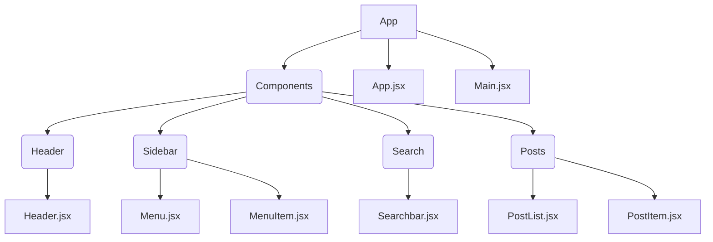

# React Cohort Dashboard Challenge
Original repo with instructions: https://github.com/boolean-uk/react-cohort-dashboard-challenge

## Component Tree Diagram

## Core Checklist
- [ ] Everything that *can* be its own component, *should* be its own component. You **must** provide evidence of planning your components by creating a component tree diagram. Include your diagram as a file in the root directory of this repository.
- [ ] Users should be able to create a new post. The new post should be displayed at the top of the post feed.
- [ ] Users should be able to comment on existing posts.
- [ ] Posts and comments should show the initials of the author in a coloured circle.
- [ ] Clicking a posts title (under the author name) should take the user to a separate route that shows only that post and all of its comments. You **must** use a route for this, not an array filter.
- [ ] You must use [this style guide](./STYLE_GUIDE.md) to implement the colour scheme.
- [ ] The layout does not need to be mobile responsive, nor does it need to be pixel perfect. Get as close as you can, but your main focus should be on React - not CSS.
